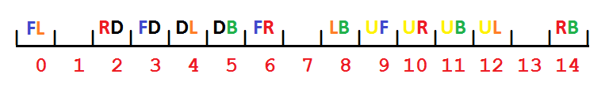

# bandaged-cubes-enumerator
For introduction to bandaged cubes see [here](https://github.com/ladislavdubravsky/bandaged-cube-explorer). This project aims to enumerate and analyze set of all bandaged 3x3s as a whole.

## Definitions
We'll think of standard 3x3 as having 26 cubies: six face centers denoted as `U, F, R, D, B L`, twelve edges denoted as `UF, UR, UB, UL, DF, DR, DB, DL, FR, RB, BL and LF`, and eight corners denoted as `UFR, UFL, UBR, UBL, DFR, DFL, DBR, DBL`. There are 48 pairs of adjacent cubies (order in pair doesn't matter). In corner-edge pairs such as `(UF, UFR)` the edge identifier is always a substring of the corner identifier and we'll denote these pairs more succintly as just the corner identifier with edge letters lowercase, e.g. `ufR`. The remaining pairs join a face center and an edge and will be denoted as xy where x is a face center and xy is an edge, e.g. `uf`.

**Definition 1.** Bandaged cube is a mapping from the set of adjacent cubie pairs into `{0, 1}`.

Meaning of this is that we are free to decide which pairs to glue together. Upside of this is easy enumeration - there are 2^48 bandaged cubes. Downside is that it is not what we really want. Our problem lies in the fact that we want to be turning the faces of our cubes. Consider the bandaged cube with `ufR` and `uf` pairs glued. The cube is as good as if `uFr` and `ur` were glued too. The latter two pairs are *implicit bonds* for our bandaged cube. We'll try to get rid of a number of implicit bond types right away in definitions.

**Definition 2.** Let us view the standard 3x3 as a set of 3x3x3 = 27 geometrically arranged cubies, enlarging our cubie listing with an imaginary core center cubie `C`. Bandaged cube is a [partition](https://en.wikipedia.org/wiki/Partition_of_a_set) of this set such that each part is a geometric [cuboid](https://en.wikipedia.org/wiki/Cuboid), which we'll also call a block. For an illustration refer to picture below.


There is still something to be wanted. Consider partition into blocks of just one cube layer as below.
```
114
254
233
```

Positions with same number belong to same block. There is no way blocks of this partition can be moved apart using face turns. The partition is as good as if the whole layer was bandaged into a single block. This motivates the third definition:

**Definition 3.** A *face plane* is a plane separating a cube face (9 cubies) from the rest of the cube (18 cubies). Now:
1. Start with a set `S` containing one element, the fully bandaged 3x3x3 block (i.e., puzzle equivalent to 1x1x1 cube)
2. Pick any element from `S` and split it in two cutting it by a face plane. Replace the original block in `S` by the two new blocks.
3. Either end the process or return to step 2.
We'll call any partition of 3x3x3 cube into blocks that can be obtained by the process above a bandaged cube.

This is almost good. Using this definition there is a bandaged cube, which has a single glued pair `(U, C)`, where `C` is the imaginary core cubie. This doesn't have a physical counterpart on the bandaged 3x3 set, so we exclude puzzles with these imaginary core bonds from exploration. Therefore:

**Definition 4.** is same as definition 3 except replace step 3 by: *If there is a size 2 block containing the core cubie, return to step 2. Otherwise either end the process or return to step 2.*


## Representation finding

